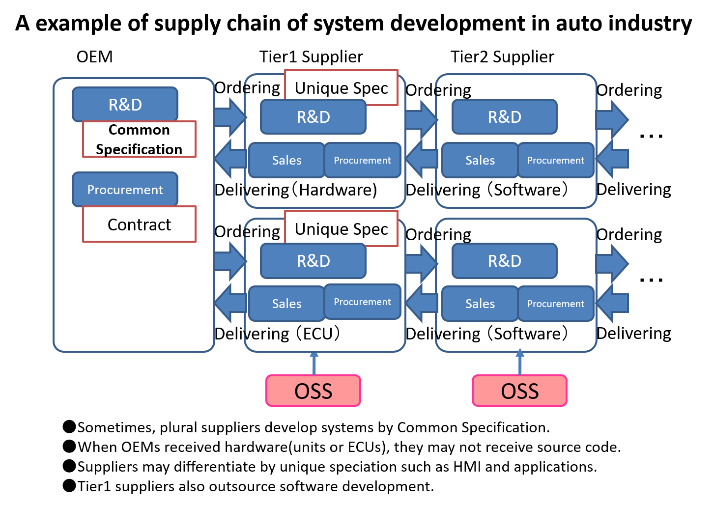
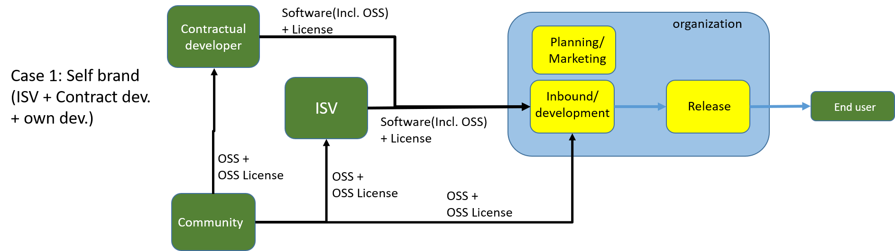
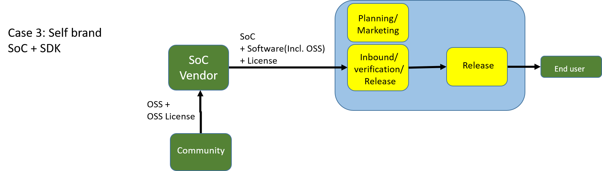
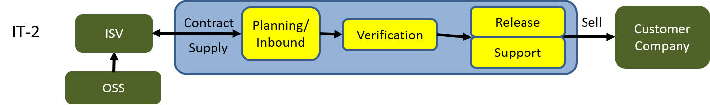
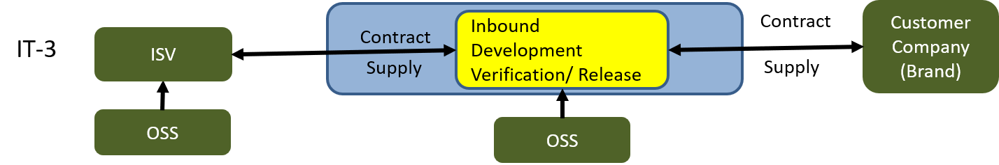
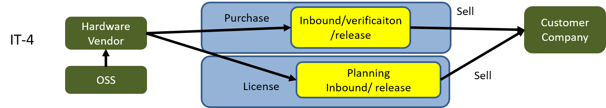
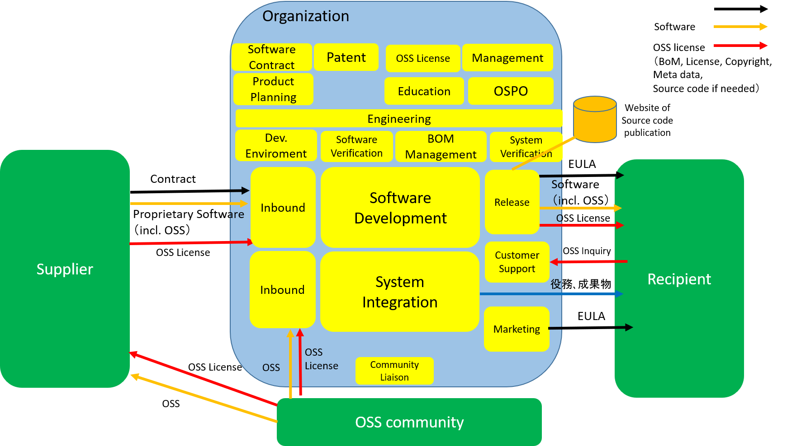

# Report of the studies on business workflow and roles for software development

### by the OpenChain Japan work group

## 1.	Background of the work
For an organization, to understand its business workflow for software development is critical to improve OSS compliance process. In this context, “business workflow” means how software and license information is received from a supplier, transferred and processed from section to section inside an organization, and finally released to a recipient. Inside an organization, several functional blocks(teams) may cooperate each other to achieve OSS compliance.

The new proposal for the training part of the OpenChain specification requires an organization to define the roles for OSS compliance process. 

Therefore, it is important to share examples of how the roles could be structured in an organization. The OpenChain Japan work group would like to contribute by providing examples of the roles in business workflow.

The outcome of the studies has been disclosed at the OpenChain GitHub site and wiki.

## 2.	Approach taken by the Japan work group
The Japan work group took the following approach:

* (1)	Business workflow: At first, before defining the roles, the Japan work group has studied several examples of business workflows in industries, such as Automotive, CE(consumer electronics) and IT. The examples of the business workflow diagram across different domains have been created by menber companies, and those are also very useful references for a company to analyze its organization when applying OSS compliance process to itself.

* (2)	Universal model of business workflow: Then the Japan work group has defined the universal model of business workflow derived from examples. This model consists of “supplier”, “organization” and “recipient”. The “organization” has internal functional blocks, those are candidates of roles.

* (3)	Roles: From the universal model, the Japan work group has defined the roles. The roles are not organizational but functional, because a function in OSS compliance can be carried out by different organizational units. For example, reviewing a license is done by legal department in some companies, and by intellectual property department in other companies. It is useful to define roles as functional, so that different companies can easily apply the roles and its concept to themselves. The roles are listed with explanation.

 
## 3.	Business workflow
The Japan work group has studied business workflow across automotive, CE and IT industries. 
 
## 3-1.	 Automotive industry (case for development of infotainment system)
The automotive industry has the layer structure for product development. The supply chain of the automotive industry consists of OEM (an automotive company) and Tier-x(x-layer) suppliers. An OEM directly contracts with Tier-1 suppliers to develop a system. OSS comes indirectly via Tier-x suppliers. The diagram shows the layered relationship of software supply chain. 

(The following figure is temporarily described in Japanese language. The figure will be replaced with English language version.)

 
## 3-2.	 CE (consumer electronics) industry
CE industry has several patterns for product development. Its business is B2C.(Its customer is an end user.) The diagrams are categorized according to the patern who has the brand of a product, and who develop(s) a product with whom. 

### 3-2-1. Case CE-1: (brand: own brand / development: own development with ISV and contractual developer)
CE-1 is a typical pattern for development of CE products. A company develops a product in cooperation with a contractual software developer and an ISV (independent software vendor). In this case, the company has direct connection with the contractual developer and the ISV. The company releases software embedded in a product to end users. OSS developed by a community comes directly to the company, and indirectly via the contractual developer and the ISV. 

 
### 3-2-2. Case CE-2: (brand: own brand / development: contractual developer)
In this case, a CE company does not develop software by itself, instead, a contractual developer develops whole software in cooperation with a ISV and the CE company receives software and verifies and releases software embedded in a product to end users. OSS developed by a community comes indirectly via the contractual developer and the ISV. 

 
### 3-2-3. Case CE-3: (brand: own brand / development: SoC vendor)
In this case, a CE company does not develop software by itself, instead, an SoC vendor develops whole software and the CE company receives software and verifies and releases software embedded in a product to end users. OSS developed by a community comes indirectly via the SoC vendor. 

### 3-2-4. Case CE-4: (brand: own brand / development: ODM vendor)
In this case, a CE company does not develop software by itself, instead, an ODM vendor develops whole software and the CE company receives software and verifies and releases software embedded in a product to end users. OSS developed by a community comes indirectly via the ODM vendor.

 
### 3-2-5. Case CE-5: (brand: own brand / development: system integration)
In this case, a CE company purchases a hardware product, and builds system integrating with the purchased hardware and own developed software and service. The CE company integrates system solution and releases the system solution to end users. OSS developed by a community comes indirectly via the hardware product company.

 
## 3-3.	 IT industry
IT industry has several patterns for product/service development. Its business is B2B.(its customer is a company) The diagrams are categorized according to the patern who has the brand of a product, and who develop(s) a product with whom. 

### 3-3-1. Case IT-1: (brand: own brand / development: own development)
IT-1 is a typical pattern for development of IT industry. A company develops system by itself. The company releases software embedded in a product to a customer company. OSS developed by a community comes directly to the company. 

### 3-3-2. Case IT-2: (brand: own brand / development: ISV or contractual development)
In this case, an IT company a CE company does not develop software by itself, instead, an ISV (or contractual developer) develops whole software, and the IT company receives software and verifies and releases software embedded in a system to a costomer company. The company has direct connection with the ISV. OSS developed by a community comes indirectly via the ISV. 

### 3-3-3. Case IT-3: (brand: customer's brand / development: ISV or contractual development)
In this case, the costomer company has the brand of the developed system. an IT company is entrusted to develop the system by the customer company. The IT company develops software in cooperation with an ISV. THe IT company receives software and integrate it with its developed software, and releases to the customer company. OSS developed by a community comes directly, and indirectly via the ISV.

### 3-3-4. Case IT-4: (brand: own brand / development: system integration)

In this case, an IT company purchases a hardware product, and builds system integrating with the purchased hardware.  The IT company integrates system solution and releases the system solution to a customer company. OSS developed by a community comes indirectly via the hardware product company.

## 4.	Universal model of business workflow
The Japan work group has defined the universal(abstract) model of business workflow derived from examples. This model consists of “supplier”, “organization”, “recipient” and "OSS community". The “organization” has internal functional blocks. The specific business workflows are different, organization by organization across industries, so that the Japan work group concluded the abstract model which can be universally applied to a specific workflow is needed. 

 
## 5. Roles
The Japan work group extracted the roles from the universal model, and specified the description of each role. These roles are defined as functional blocks, so that each organization can implement these roles in its own organizational blocks. Several roles can be carried by one organization block. 

## 5.1．table of roles - part 1

| Role        | Description  | Note         |
|:------------|:-------------|:-------------|
| software development | to develop software, to receive software from a supplier, to release software to a recipient | It can be divided into inbound, internal development and release functions. |
| software verification | to verify software, to receive software from a supplier and to release software to a recipient in ODM development case  |  In ODM develpment case, an organization entrusts software development to ISV without its own development. |
| system engineering | to design system     |  In SI business  |
| OSS license | to review a new OSS license | This function is usually carried out by either legal section or IP section. It depends on the organization. |
| intellectual property / patent | to reveiw intellectual property in OSS |  |
| engineering | to review OSS from the view point of software technology |  |
| management / executive | to authorize OSS policy and activity, to make a corporate level decision on OSS |  |
| community liaison | to establish relationship with an OSS community, to communicate with an OSS community |  |
| education         | to train an engineer and staff, to prepare education materials |  |
| customer support  | to receive an external inquiry |  |

## 5.2. table of roles - part 2

| Role        | Description  | Note         |
|:------------|:-------------|:-------------|
| OSPO (Open Source Program Office) | to promote OSS and OSS compliance, to receive internal inquiries and resolve issues | It may consist of OSS officer, legal representative, engineering representative.   |
| environment       | to provide tools for software development and licensing |  |
| software contract | to review a contract of software development, to gives advices |  |
| product planning  | to plan products or sevices |  |
| M&A               | to audit a target company from the view point of OSS license |  |
| marketing         | to communicate with a customer company   |

