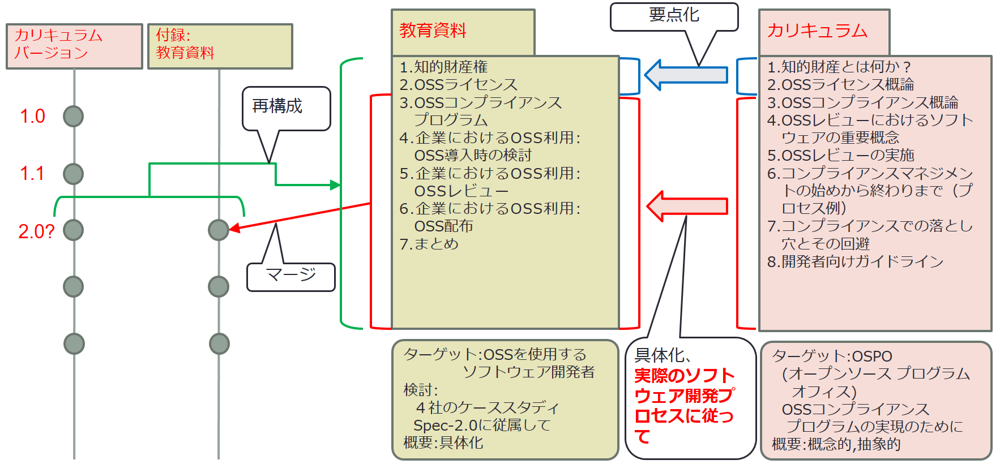
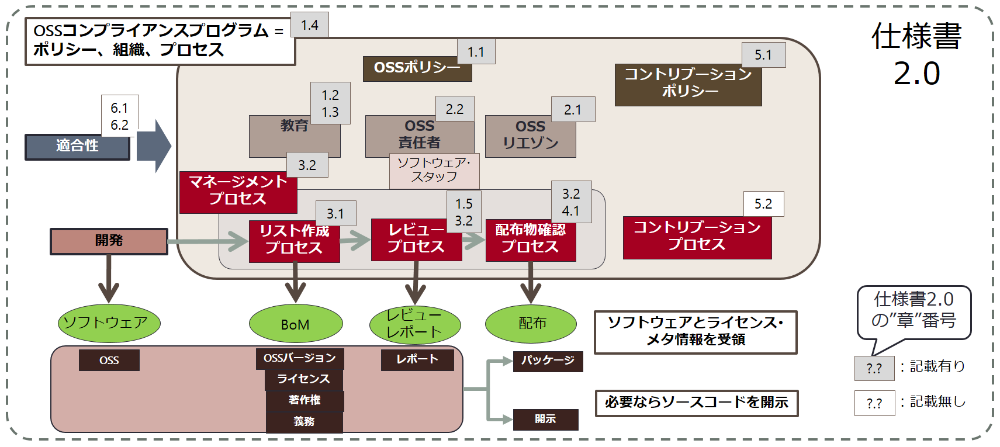

---
---
# 教育資料
#### (コンプライアンスプログラム･バージョン)
---
## OSS教育資料(コンプライアンスプログラム･バージョン) スライド 　(OpenChain 仕様書 2.0版対応)
**本教育資料が、企業がOSSのコンプライアンスに関する教育を行う際に、 OpenChainの仕様に準じた形で教育コンテンツを構成するための、一助となれば幸いである。本教育資料は、 OpenChainの仕様書準拠や認定取得を、一切保証するものではない。**

**本スライドは Creative Commons CC0 1.0 Universal ライセンスの下でリリースされています。**
**本スライドの使用、改変および共有にあたっての制限はありません。**
**また、これらは無保証となります。**

**本スライドは日本国法令に準じています。日本国外では法的要求事項が異なる場合がありますのでコンプライアンストレーニングプログラムで本スライドを使う際にはこの点を考慮する必要があります。**
**本スライドは法的助言を提供するものではありません。These slides do not contain legal advice**

---
---
# Disclaimer（免責事項）

本文書は、The Linux Foundation におけるOpenChain プロジェクトJapanWGの日本語ドキュメント「 OpenChain 教育資料 (コンプライアンスプログラム･バージョン) 」です。ただし、日本語版と翻訳版との間で何らかの意味の違いがある場合には、日本語版が優先されます。  
また、OpenChain は世界のメンバー企業が参加しているプロジェクトですが、資料の細部について必ずしも各国の法令に対応していない可能性があります。翻訳版を日本以外で利用する際には、各企業の法務部門を加えた検討が不可欠です。 
 

---
---
# OpenChain 教育資料(ｺﾝﾌﾟﾗｲｱﾝｽﾌﾟﾛｸﾞﾗﾑ･ﾊﾞｰｼﾞｮﾝ)とは？

- OpenChain プロジェクトは、フリー／オープンソース ソフトウェア（以降「OSS」)コンプライアンスプログラムの中核となるコンポーネントを明確にし、これを共有することを促進するためのプロジェクトである。
- OpenChainの中核が仕様書（Specification）となる。OSSコンプライアンスプログラムが満たすべき主要要件を明確にし、これを公開している。
- OpenChain パンフレットは、OSSの初歩を広くアピールし、OSSの利用を啓発するための資料である。
- OpenChain 教育資料(コンプライアンスプログラム･バージョン)は、最初にOSSの利用を手掛ける会社向けに、単純な役割想定のもと、ソフト開発者向けに準備した教育資料である。
- これらのスライドは、企業が仕様書2.0の記載の全要件を満たすことを奨励している。ただし、一切保証しているものではない。詳細は左記：https://www.openchainproject.org

---
---
# OpenChain 教育資料(ｺﾝﾌﾟﾗｲｱﾝｽﾌﾟﾛｸﾞﾗﾑ･ﾊﾞｰｼﾞｮﾝ)とは？

## OpenChain 教育資料(ｺﾝﾌﾟﾗｲｱﾝｽﾌﾟﾛｸﾞﾗﾑ･ﾊﾞｰｼﾞｮﾝ)概要

---
---
# OpenChain 教育資料(ｺﾝﾌﾟﾗｲｱﾝｽﾌﾟﾛｸﾞﾗﾑ･ﾊﾞｰｼﾞｮﾝ)概要

本教育資料中、【§】で関連する仕様書2.0の”章”番号を記載した。

---
---
# コンテンツ
1. [OSSとは](What_is_OSS.md)
1. [知的財産権](Intellectual_Property.md)
1. [OSSライセンス](OSS_License.md)
1. [OSSコンプライアンスプログラム](OSS_Compliance_Program.md)
1. [企業におけるOSS利用：OSS導入時の検討](OSS_Inbound.md)
1. [企業におけるOSS利用：OSSレビュー](OSS_Review.md)
1. [企業におけるOSS利用：OSS配布](OSS_Distribution.md)
1. [まとめ](Conclusion.md)
1. 問い合わせ先
1. 参考文献・団体

---
[次（OSSとは）へ](What_is_OSS.md)
