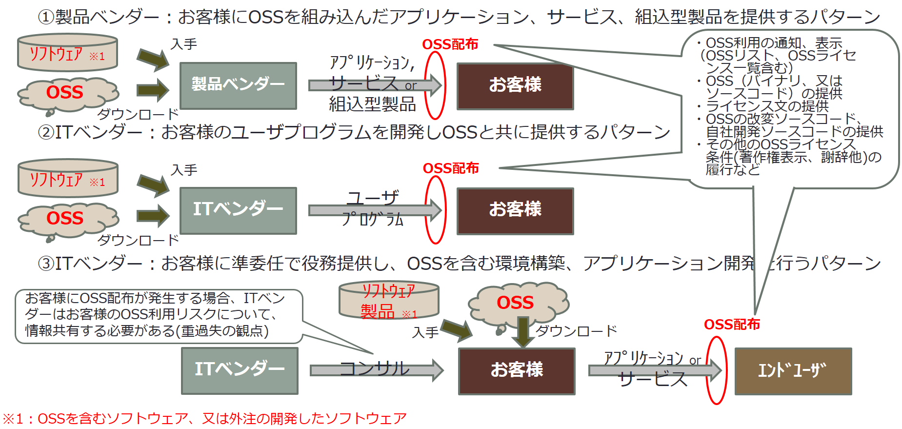

---
---
# 第6章
## 企業におけるOSS利用
## OSS配布

---
---
# OSS配布:ビジネス形態毎の配布の例            【§3.2,4.1】

---
---
# OSS配布の例                                               【§3.2】
## OSSの配布につながる例をいくつか挙げておく。いずれの場合もOSSを配布する人や企業などはライセンスで定められた事柄をきちんと実施しなくてはならない。
1. 半導体企業から提供されたソフトウェア開発キット(SDK)の中にOSSが含まれ、製品の中に組み込まれる例
- OSS配布：製品を開発し、発売する人が対象
- SDK提供者からSDKに含まれるOSSについての適切な情報が必要
1. 製品開発を他社委託(ODM)、他社製品を自社ブランドで製品化(OEM)する際にODMやOEM委託先が製品の中にOSSを含める例
- OSS配布：製品開発を委託したり、自社ブランド製品を発売する企業が対象
- ODMやOEM製品提供者から製品に含まれるOSSについての適切な情報が必要
1. OSSを含む製品の出荷、モバイルアプリケーションソフトウェアのリリース、ソフトウェアアップデータのリリースを行う例
- OSS配布：製品を出荷する人、ソフトウェアをリリースする人が対象
- OSSライセンスを的確に理解し、条項に従って配布に伴い、求められた事柄を実施
1. Webページなどで使われるJavaScript のスクリプトの例
- OSS配布：Webページからユーザーのマシンにプログラムが渡されることがあればWebページの作成者/企業が対象
- JavaScript で書かれたプログラム（スクリプト）がOSSとして作られていると、Webページの閲覧時にOSSの頒布が行われているということになる。OSSライセンスの遵守が必要

---
---
# ソフトウェアサプライチェーン     【§3.2】
## ソフトウェアサプライチェーンの中において、
## 　OSSの不適切な利用、
## 　ライセンス情報の不足があると
## 最終製品を作り上げる段階で大きな問題になる（図1）
## 　⇒最終製品が出荷できなくなる事態
## 　第三者やOSSの著作権者からの指摘の可能性あり

# 　　　　　　　　↓

## サプライチェーンの上流段階で問題を把握して対策を講じることが重要
## サプライチェーンを構成する企業・団体それぞれがすべきことを的確に実施し、相互に信頼関係を構築し、互いに適切な情報や必要な素材（たとえばソースコードなど）の受け渡しをしっかりと行う事が重要

---
---
