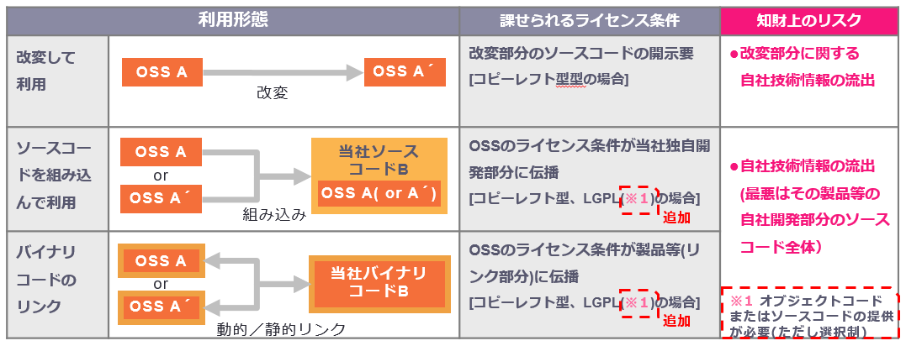
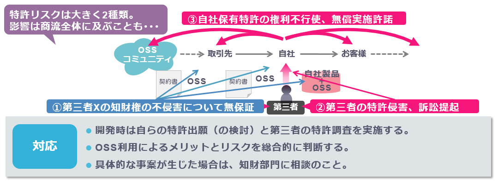
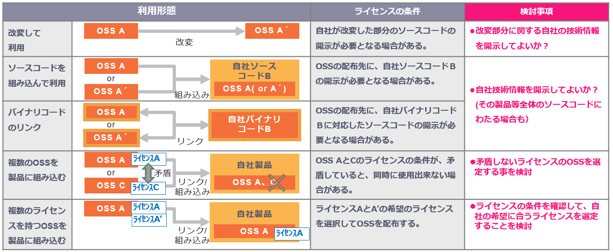
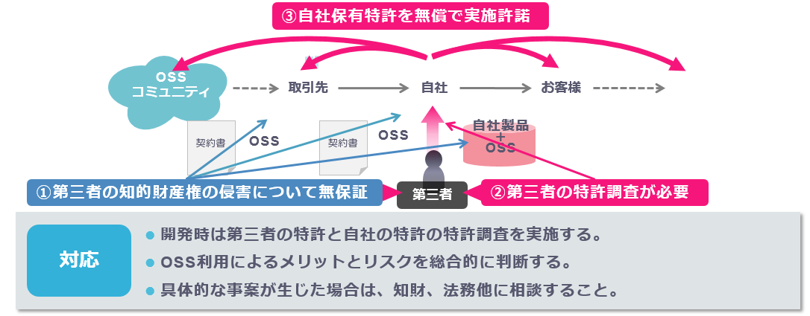

---
---
# 第4章
# 企業におけるOSS利用
# OSS導入時の検討

---
---
# OSS導入時の検討・実施事項

## OSS利用形態、ライセンス条件、リスクの確認

## 利用形態､利用形態により課せられるライセンス条件、リスクを確認することで､｢ソースコードの開示の必要十分性の審議｣｢開示範囲を不必要に広げない実装上の工夫｣｢非コピーレフト型のOSSの利用や独自開発の検討｣などの検討事項を明確化する。

---
---
# OSS導入時の検討・実施事項

## 複数のOSSを使用する場合、ライセンスの互換性があることの確認が必要

### 複数のOSSを使用する場合、複数のOSSのライセンスが、矛盾しないこと(ライセンス同士が矛盾しないこと：「互換性がある」)を確認すること。OSSの他に、活用するソフトウェア、ライブラリに適用されるライセンスとの間も同様。

### 矛盾するライセンスを同時に使用すると、少なくとも一方がライセンス違反となり、そのOSSが使えなくなる。矛盾するライセンスを同時に使用している製品､アプリケーションは、頒布できなくなる。

### 互換性のある例：(a) LGPLv3 – GPLv3、(b) AGPLv1 – GPLv3、(c) Apache License v2.0 – GPLv3、 (d) MIT License – GPLv3,v2

### 互換性のない例：(e) 4-Clause BSD License － GPLv3、 (f) Apache License v2.0 ー GPLv2

### ライセンスの互換性は、難しい問題。専門家に相談するようにしましょう。

---
---
# OSS導入時の検討・実施事項

## OSSによっては、複数のライセンスを有するものがある。下記により選択する。

### OSSは、著作権者の意思によってライセンスが割り当てられる。ライセンスの中には互換性がないものがある。例えば、あるOSSの著作権者は、皆が改善してより良いOSSとなるよう「コピーレフト」のGPLv2ライセンスを割り当てたとする。しかし、GPLv2とApache License v2.0は互換性がないため、同時に使用できない状況が発生する。その際、OSSの著作権者は、広く利用してもらう目的で、他のライセンスでも使えるように別なライセンスも割り当て、OSSの利用者がライセンスを選択可能となるデュアルライセンスでOSSを公開する。

### デュアルライセンスは、先ずは全てのライセンスの内容を確認した上で、配布時には、希望のライセンスを選択して配布可能です。(１つを選択しても良いし、複数を選択しても良い。選択したライセンスの義務を履行して配布を行うことは必要。)

### また、デュアルライセンスによっては、複数のライセンスを全て履行する事を要求している場合もある。この場合は、複数のライセンスの義務を履行して配布を行うことが必要となる。

### 製品版OSSを提供しているベンダーは、製品版OSSの元のOSSのライセンスと、ベンダーの定義したライセンスの、デュアルライセンスで製品版OSSを提供している場合が多くあります。この場合も、希望するライセンスを選択して利用すれば良い事になります。（ベンダーの定義したライセンスは、通常非コピーレフト型となっている場合が多い。)

---
---
# OSS導入時の検討・実施事項

## 特許への対応

### OSSライセンスは第三者の知財権を侵害していないことを保証していないため（図①）、第三者からの訴訟に巻き込まれるリスクがある（図②）。

### また、利用するOSSと関連する特許を当社が保有している場合に、その権利不行使（無償での実施許諾しなければならない）の義務を課す（図③）ライセンスもある。

---
---
# OSS導入時の検討・実施事項

## OSSのライセンスによっては、下記の条件が発生する場合がある。OSS利用推進、法務、知財他と相談して、利用するOSSのライセンス条件を確認する必要がある。

---
---
# OSS導入時の検討・実施事項

## 特許への対応

### 通常、OSSライセンスは第三者の知的財産権(特許他)を侵害していないことを保証していない（図①）。OSSを配布する場合は、第三者の特許調査をしておく必要がある（図②）。また、利用するOSSと関連する特許を自社が保有している場合に、その特許を無償で実施許諾しなければならない義務を課す（図③）ライセンスもある。

---
---
