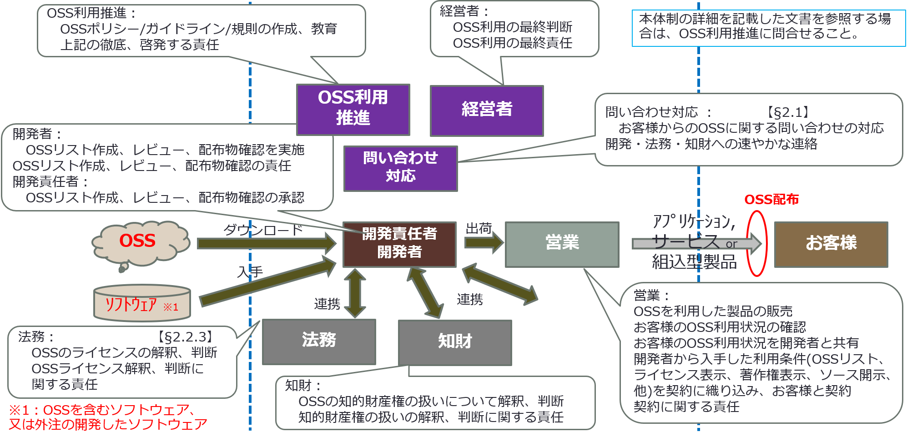
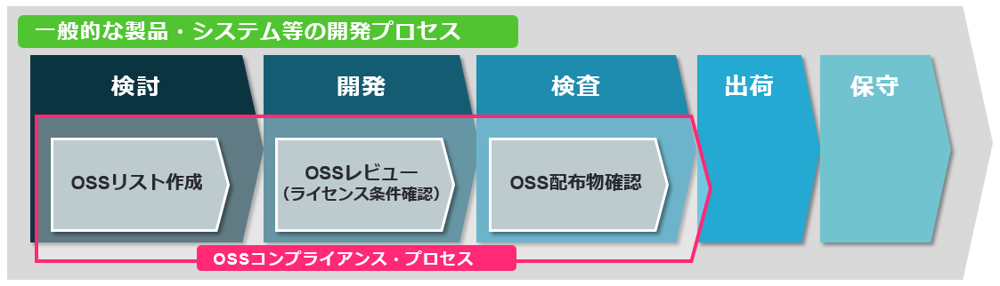
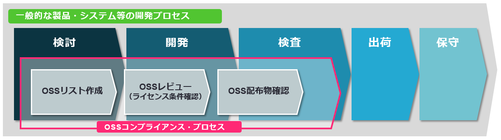
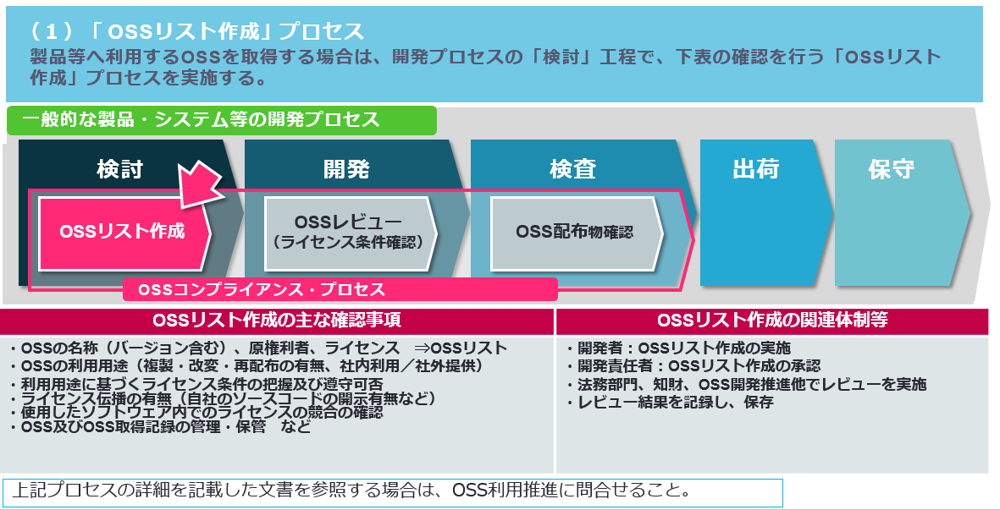
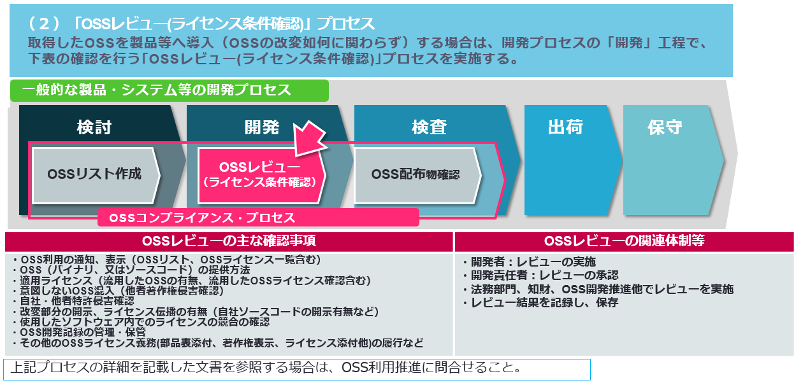
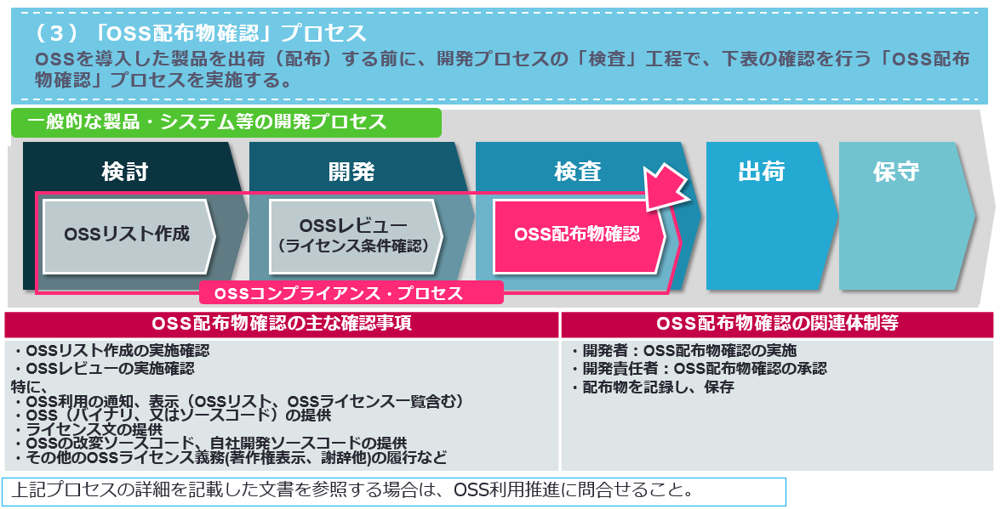

---
---
# 第3章
# OSSコンプライアンスプログラム

---
---
# OSSコンプライアンスプログラム

## OSSコンプライアンスを成功させてきた組織は （ポリシー、プロセス、トレーニングやツールなどから成る）独自のOSSコンプライアンス プログラムを作り上げている。それには以下のような意図がある。
   * （商用もしくはそれ以外の） 製品におけるOSSの効果的使用を促進する
   * OSS開発者／権利保有者の権利を尊重し、ライセンス義務を果たす
   * OSSコミュニティに参加し、コントリビュートする

---
#### このスライドで、企業が、社内文書として内部OSSポリシーがどこにあるかを示すことができるようにしています。
---
#### This slide is intended to help a company identify where their internal OSS policy is located in the company documentation.

---
---
# OSSポリシー

## <<本スライドは、OSSポリシーが企業内のどこに置かれているかを周知するためにご使用ください（OpenChain仕様書2.0の1.1.1項）>>

## OSSポリシーのサンプルは、The Liunux Foundationの Open Compliance Programのサイトより入手可能
  * https://www.linux.com/publications/generic-OSS-policy

## 先ず、これからOSSを利用しようとしている組織では、 OSSコミュニティへの参加(コントリビューション)は、将来の課題となる場合が多い。その場合、先ずOSSポリシーでOSSコミュニティへの不参加を明示する必要がある。

---
---
# OSS ポリシー(The Liunux FoundationのOpen Compliance Programのポリシー例)

## OSSポリシー

## コンプライアンスプロセスを実施するための手順、作業指示、トレーニング、およびツールサポートを、以下のユースケース（および自社によってソフトウェアが外部に伝達されるその他すべてのユースケース）について、確立する必要がある。

### ユースケース１：自社の成果物にOSSを含める場合

### コンプライアンスプロセスには以下が含まる（必ずしもこれだけに限定されない）。
  * 自社の成果物に含まれるすべてのOSSの識別
  * 識別されたOSSパッケージを使用するようOSRBに要求を提出する。
  * レビュー（アーキテクチャの依存関係分析、特定されたOSSの起源分析、ライセンスの識別と分析、知的財産権への潜在的影響の分析などを含む）
  * 承認決定
  * 満たすべき義務の特定
  * 義務の充足

### ユースケース２：自社による頒布目的で入手したサードパーティの市販ソフトウェア

### この文書のポリシーは、ベンダーがライセンスを取得したパッケージソフトウェアとカスタムソフトウェアの契約開発に適用されます。自社にソフトウェアを提供する開発者は、その成果物中に含まれるOSSを、以下を含んで開示する必要がある。

  * バージョン番号を含む、すべてのOSSコンポーネントのリスト
  * 該当するすべてのライセンス（メインライセンスだけでなく、該当する全てのライセンス）
  * 製品マニュアルの資料（ライセンステキスト、著作権表示、謝辞と帰属を含む。(これらに限定されない））
  * （該当する場合）OSSのソースコード（開発者による変更を含む）
  * OSSコンポーネントおよびその他の製品コンポーネント間の依存関係、インターフェイス、および相互作用を示す依存関係チャート
    * 自社に配布されたソフトウェアでのOSSの使用は、すべて自社によって確認および承認される必要がある。

### ユースケース３：サーバーソフトウェアの特定の規則

### サーバーソフトウェアに自社のOSS利用ポリシーに適合しないライセンスに基づいて使用許諾されたOSSが含まれる場合、そのような使用は、自社の成果物に含まれるOSS用に定義されたプロセスに従ってレビューおよび承認されなければならない。サーバーソフトウェアがホスティングの目的で第三者に配布される場合、またはその他の目的で外部のパーティーに配布される場合は、OSSの使用を確認し、承認する必要がある。それ以外の場合は、サーバーソフトウェアでのOSSの使用する場合、自社によってホストされているレビューや承認を受ける必要はない。

---
---

# OSSコンプライアンス体制例

---
---
# 一般的な製品及びシステム等の開発プロセス

## 昨今、OSSを製品やシステムの部品として利用することが増えてきている。

## OSSを製品等に利用する場合においても、基本的なプロセスは、過去より実施されている開発プロセス等となんら変わることはない。

## 但し、OSSを利用した開発では、開発期間の短縮や開発コストの低減が見込めるが、その反面、OSSの特徴である「無償」、「無保証／無補償」であることに留意した取扱が必要になってくる。

## まず、各社毎に多少運用が異なると想定されるが、一般的に行われている製品やシステムの開発プロセス（以下、開発プロセス）を下記と想定し説明する。

## 各工程の詳細な説明は割愛するが、開発プロセスは以下５つの工程により構成される。
  * （１）検討　（２）開発　（３）検査　（４）出荷　（５）保守

---
---
# 開発プロセスと｢OSSコンプライアンスプロセス｣との関係

## OSSの特徴に留意した取扱いを行う上で必要な各工程と、開発プロセスの工程との対応関係を下図に示す。下図の開発プロセスの各工程内で、OSS利用に係る妥当性などの判断を行う。

## なお、上記OSSの特徴に留意した取扱いを行う上で必要な工程群を、便宜上「OSSコンプライアンス・プロセス」と称す。

## 「OSSコンプライアンス・プロセス」は以下３つの工程により構成される。
  * （１）OSSリスト作成　（２）OSSレビュー（ライセンス条件確認）　（３）OSS配布物確認　

---
---
# OSSコンプライアンス・プロセスとは

## 「OSSコンプライアンス・プロセス」 は、開発プロセス内で実施される以下３つの工程より構成される。

### （１）「検討」工程内での、「OSSリスト作成」
### （２）「開発」工程内での、「OSSレビュー（ライセンス条件確認）」
### （３）「検査」工程内での、「OSS配布物確認」

## 「OSSコンプライアンス・プロセス」のそれぞれの工程での確認事項や関連部門などについては、次ページから説明する。

---
---
# OSSリスト作成プロセス例　　　　　　　【§3.1】

---
---
# OSSレビュー(ライセンス条件確認)プロセス例

---
---
# OSS配布物確認プロセス例　　　　　　　　【§3.2,4.1】

---
---

---
---
