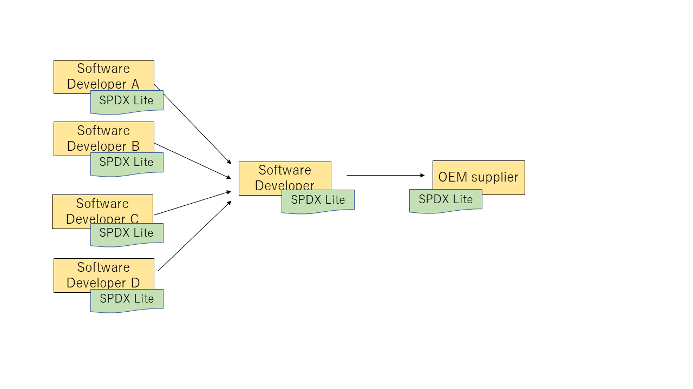

# Guideline for SPDX Lite

This document describes a procedure to create artifacts for exchaninging 'license information'(* ) between organizations, to comply with oss license, when organization exchange open source software (OSS) and other software packages. In this document, the 'SPDX Lite' is explained for the format in exchanging license information. The supposed product types are consumer products (embedded systems) that are widely distributed (sold) to end users. 

(* )In this document, 'license information' is used for describing the whole set of the artifacts, software packages and other information that are required to be provided when distributing OSS. 

# Table of Contents

1. The need of a license information file
1. Mandatory items for a license information file
1. How to create a license information file
1. Samples of a license information file

# 1. The Need of a License Information file

Open Source Software (OSS) has become essential to modern software development. OSS can be freely used, modified, and distributed by anyone who complies with the associated license conditions. To comply with the terms and conditions of the license, license information of the OSS is required. 

Regarding the shipment of a product that OSS is incorporated into, many companies are involved, such as a module company, a final product company and a sales company. To comply with OSS license for the product, all the companies in the supply chain are required to provide exact license information. Even if only one company fails to provide the proper license information, all the companies in the downstream of the supply chain cannot comply with OSS license. When everyone who engages in the supply chain understandands correctly, the OSS license compliance is achieved appropriately. 

Please read "Open Source Software License Compliance General Public Guide", if you need more detail.
https://github.com/OpenChain-Project/curriculum/tree/master/supplier-leaflet

There are major two challenges for excanging license information between organizations.

  * Regarding license information, there are many items, such as the name of OSS, the version of OSS, the origin of the source code and other various stuff. This complexity of license information may cause the difficulty for the staff to understand all the license information.
  * Regarding the exchanged format, the format requested by a recipient may differ from those requested by other recipients depending on organizations. These differences may cause the diffculty for providers to create and manage many different formats.

To overcome these challenges, this document defines the minimum and neccessary license information, so that anyone can easily create a simple and correct license information. This minimum and neccessary format is called the SPDX Lite. In the following section, the SPDX and the SPDX Lite are explained briefly. 

### SPDX

SPDX®（Software Package Data Exchange®） project, hosted by the Linux Foundation, has a standardized format for exchanging license information, such as software name, version, license and copyright text of software package.
https://spdx.org/

### SPDX Lite

The SPDX specification defines the excellent format to exchange license information between organizations. However, the format defined by the SPDX specification is not so easy for beginners to create and use it without the deep knowledge and tools, due to the required license information related to software package is huge and complex. Therefore, the SPDX Lite has been defined as the minimum format for the oss license compliance in the software supply chain. The fields in the SPDX Lite have been defined collecting from the actual business use cases, so that the SPDX Lite has been well defined to represent license information. The SPDX Lite file can be created and reviewed manually without tools.

The following is a sample of the SPDX Lite. The SPDX Lite format can be easily created by spread sheet.

### Relation between SPDX and SPDX Lite

The fields of the SPDX Lite have been selected from the point of view of the manual creation and review, so that the SPDX Lite has defined the minimum format. All the mandatory fields in the SPDX are included in the SPDX Lite as mandatory. The SPDX Lite has the following features.

  * It is very easy for beginners to understand. 
  * It can be the starting point of oss license compliance. 
  * The way describing license information and a software package one by one, which is not complex and is easy to read, enables manual review. 
  * The compatibility between the SPDX and SPDX Lite enables the use of the same compliance tools.

On the other hand, the SPDX can describe wider range of information in software packages.

The use of the SPDX and the SPDX Lite can be selected in negotiation between organizations in the software supply chain in each cases. 

# 2. Mandatory items for a license information file

The following explains items of SPDX Lite and the necessary reasons for each item.

## SPDX Lite Item List

| SPDX Lite section no. | corresponding SPDX section no. | License Info. | Tag  | 
|:-------|:-------|:--------|:-------|
|L1.1  |2.1  | SPDX Version           |Mandatory, one |
|L1.2  |2.2  | Data License           |Mandatory, one |
|L1.3  |2.3  | SPDX Identifier        |Mandatory, one |
|L1.4	 |2.4	 | Document Name	        | Mandatory, one |
|L1.5	 |2.5	 | SPDX Document Namespace| Mandatory, one |
|L1.6	 |2.8	 | Creator	              | Mandatory, one or many |
|L1.7  |2.9  | Created                | Mandatory, one |
|L2.1	 |3.1	 | Package Name	          | Mandatory, one |
|L2.2	 |3.2	 | Package SPDX Identifier| Mandatory, one |
|L2.3	 |3.3	 | Package Version        | Optional, one |
|L2.4	 |3.4	 | Package File Name      | Optional, one |
|L2.5	 |3.7	 | Package Download Location | Mandatory, one |
|L2.6	 |3.8	 | Files Analyzed         | Optional, one |
|L2.7  |3.11 | Package Home Page      | Optional, one |
|L2.8	 |3.13 | Concluded License      | Mandatory, one |
|L2.9	 |3.15 | Declared License       | Mandatory, one |
|L2.10 |3.16 | Comments on License    | Optional, one |
|L2.11 |3.17 | Copyright Text         | Mandatory, one |
|L2.12 |3.20 | Package Comment        | Optional, one |
|L3.1	 |6.1	 | License Identifier     | Conditional (mandatory, one) |
|L3.2	 |6.2	 | Extracted Text         | Conditional (mandatory, one) |
|L3.3	 |6.3	 | License Name           | Conditional (mandatory, one) |
|L3.4	 |6.5	 | License Comment        | Conditional (mandatory, one) |

If you do not know a value of fields, write "NOASSERTION".

### L1.1　SPDX Version
This field is the version number of the SPDX specification. This value identifies the SPDX specification that is used in an SPDX Lite file.

### L1.2　Data License
This field is the license for an SPDX file. In an SPDX Lite case, the value is set "CC0-1.0".

### L1.3　SPDX Identifier
This field is the identifier for an SPDX Lite file. The value is set a unique number in each SPDX file.

### L1.4　Document Name
This field is the name of an SPDX Lite file.

### L1.5　SPDX Document Namespace
This field is the document namespace of an SPDX Lite file. The namespace is written by Uniform Resource Identifier (URI). The namespace is used when the SPDX Lite file is referenced externally.

### L1.6　Creator
This field is the creator of an SPDX Lite file. This field identifies who created the SPDX Lite file. If the SPDX Lite file was created by an individual, indicate the person's name. If the SPDX Lite file was created on behalf of a company or organization, indicate the entity name. If the SPDX Lite file was created using a software tool, indicate the name and version for that tool. If multiple participants or tools were involved, use multiple instances of this field. Person name or organization name may be designated as “anonymous” if appropriate.

”Person: person name” and optional “(email)”
"Organization: organization” and optional “(email)”
"Tool: toolidentifierversion”

### L1.7　Created
This field is the date when the SPDX Lite file was created.

### L2.1　Package Name
This field is the name of the software package. This field identifies the software used.

### L2.2　Package SPDX Identifier
This field is the identifier that makes the software package unique in the SPDX Lite file. Software package is referenced by this field. This field distinguishes uniquely the package from the same software package. The uniqueness of the identifier is ensured by the creator.

### L2.3　Package Version
This field is the software package version. This field identifies the version of software.

### L2.4　Package File Name
This field is the actual file name of the software package. This item is used to identify the actual file of the software being used. This item is necessary because Package Name and the actual file may not be related due to the difference in the name.

### L2.5　Package Download Location
This field is the location where the software package was obtained. This field is used to obtain the same software being used.

### L2.6　Files Analyzed
This field indicates whether the file content of this package has been available for or subjected to analysis when creating the SPDX document. Write "false" when creating SPDX Lite file manually.

### L2.7　Package Home Page
This field is the home page of the software package. This field is used to obtain community information such as vulnerability information of the software being used.
(Note the difference between this field and L2.5 Package Download Location)

### L2.8　Concluded License
This is the license that the creator of the SPDX Lite file concludes that it applies to the software package. If the Concluded License is different from the Declared License, you should provide a description on the Comments on License. For NOASSERTION, it is better to describe in Comments on License. This field identifies the license of the software being used.

In addition, it is recommended to describe the license name to be described according to the Identifier of SPDX License List at the following URL.
https://spdx.org/licenses/

### L2.9　Declared License
This is the license declared by the creator of the software package. If the Concluded License is different from the Declared License, you should provide a description on the Comments on License. For NOASSERTION, it is better to describe in Comments on License.This field identifies the license of the software being used.

In addition, it is recommended to describe the license name to be described according to the Identifier of SPDX License List at the following URL.
https://spdx.org/licenses/

### L2.10　Comments on License
This field is the reason for the creator of the SPDX Lite file to conclude the information related to the license and the license. This field is used to supplement the license of the software being used.

Also, describe either the dynamic link or static link for the software being used.If the compile option excludes the specific license of the software you are using, the compile option will be described in this item. Certain licenses affect other things depending on how the software is linked. Therefore, this item is used to specify how to link software.

### L2.11　Copyright Text
This field is the copyright information of the software package. If it is difficult to extract all copyright information, we will provide the source code together.

Certain licenses require that you provide copyright information at the time of distribution. This item is used to identify the copyright information of the software being used.

### L2.12　PackageComment
This field can be used to have free comments, and is useful to provide additional information regarding the package. The recommended ussage is:  

(1)ModificationRecord
If the software package has been changed, ModificationRecord is set to ”true”.
If the software package has not been changed, ModificationRecord is set to ”false”.
ModificationRecord can be used to indicate modification of the OSS or use of a part of OSS.
The SPDX specification does not have ModificationRecord, this is original in SDPX Lite.
Some OSS licenses have the obligations when the OSS is modified, therefore the indication of modification is useful for recipients to comply with the obligations.

(2)CompileOptions
CompileOptions is used to indicate the compile option during the build process.
Compile option can be used to choose OSS modules in binary code, and each OSS module may have a different licese each other, therefore the compile option can affect the license of the binary code.

(3) Any other sub-tags
Any sub-tugs can be written in PackageCommnet field.
For example, the following tag is useful.

##### LinkMethodology
For some licenses, a way of link between modules can affect the covered range of the licenses. Information such as, dynamic link and static link is helpful for recipients to identify the covered range.

### L3.1　License Identifier
For a license not listed in the SPDX License List, this field is used to write a unique identifier. This item is used to identify the license of the software being used.

### L3.2　Extracted Text
For a license is not listed in the SPDX License List, this field is used to provide the license terms. This field is used to supplement the license of the software being used.

### L3.3　License Name
For a license is not listed in the SPDX License List, this field is used to provide the license name. This field is used to identify the license name of the software being used.

### L3.4　License Comment
For a license is not listed in the SPDX License List, this field is used to provide additional information of the license. This field is used to supplement the license of the software being used.

# 3. How to create a license information file

It is important to describe license information as much as possible. The recipient of OSS  needs license information as much as possible for complying with OSS licenses. Even if you do not know exact information, it is recommended to describe license information with a comment to explain. 

An SPDX or SPDX Lite file can be created by either a scanning tool or manual work. 

## 3.1 tools for creating license information files

The Linux Foundation provides resources for tools.

  * Japanese: https://www.linuxfoundation.jp/resources/open-source-guides/tools-managing-open-source-programs/ 
  * English: https://www.linuxfoundation.org/resources/open-source-guides/tools-managing-open-source-programs/

## 3.2 manually creating license information files 

In the following section, a sample procedure is explained. The procedure create a sample license information file for the software package "busybox-1.30.1". In this example, the software package file "busybox-1.30.1.tar.bz2" is assumed to be provided. 

#### L1.1 SPDX Version

-> SPDX-2.2

This field is set to "SPDX-2.2" or later.

#### L1.2 Data License

-> "CC0-1.0" or "LicenseRef-Proprietary-COMPANY_NAME"

This field is used to identify the copyright holder of the license information file.
When you define your own License to the SPDX Lite you wrote, you must describe license as in the SPDX specification manner such as "LicenseRef-" prefix.

#### L1.3 SPDX Identifier

-> SPDXRef-0

This field is set to a unique indentifier in the SPDX Lite files. When SPDX Lite files are combined by a recipient, it is required for the recipient to make this field as a unique identifier.

#### L1.4 Document Name
-> SPDX_Lite_busybox-1.30.1_"Date"

It is reccomended to keep the same text of the file name.

#### L1.5 SPDX Document Namespace

->

#### L1.6 Creator

-> "tool that created the file" or "mail address of the person who created the file"

A recipient of the file may inquire using this information.

#### L1.7 Created

-> YYYY-MM-DD (for example,2020-08-10)

You may use other date format which is valid on SPDX reference, such as "YYYY-MM-DDThh:mm:ssZ"

#### L2.1 Package Name

-> busybox

It is recommended to identify the official name used in a readme file.

#### L2.2 Package SPDX Identifier

-> SPDXRef-1

This field is set to a unique indentifier in the license information files. When SPDX Lite files are combined by a recipient, it is required for the recipient to make this field as a unique identifier.

#### L2.3 Package Version

-> 1.30.1

#### L2.4 Package File Name

-> "busybox-1.30.1.tar.bz2" or "busybox-1.30.1_modified_by_companyname_date.tar.bz2"

This field is set to the file name of the file.
If the software was changed and the original source code and the patchs that contain
the changes are provided, it is recommended to provide the SPDX Lite files of both the source code and the patches.

#### L2.5 Package Download Location

-> "https://busybox.net/downloads/busybox-1.30.1.tar.bz2" or "https://github.com/provider/package" or "NOASSERTION"

#### L2.6 Files Analyzed

-> false

#### L2.7 Package Home Page

-> https://busybox.net/about.html

This field is set to the home page of the software. 

#### L2.8 Concluded License

-> GPL-2.0-only

It is recommended to use the Identifier in the SPDX License List.

https://spdx.org/licenses/

#### L2.9 Declared License

-> GPL-2.0-only

It is recommended to use the Identifier in the SPDX License List.

https://spdx.org/licenses/

#### L2.10 Comments on License

-> NOASSERTION

#### L2.11 Copyright Text

-> NOASSERTION

### L2.12　Package Comment
This field can be used to have free comments, and is useful to provide additional information regarding the package. The recommended ussage is:  

(1)ModificationRecord
If the software package has been changed, ModificationRecord is set to ”true”.
If the software package has not been changed, ModificationRecord is set to ”false”.
ModificationRecord can be used to indicate modification of the OSS or use of a part of OSS.
The SPDX specification does not have ModificationRecord, this is original in SDPX Lite.
Some OSS licenses have the obligations when the OSS is modified, therefore the indication of modification is useful for recipients to comply with the obligations.

(2)CompileOptions
CompileOptions is used to indicate the compile option during the build process.
Compile option can be used to choose OSS modules in binary code, and each OSS module may have a different licese each other, therefore the compile option can affect the license of the binary code.

(3) Any other sub-tags
Any sub-tugs can be written in PackageCommnet field.
For example, the following tag is useful.

### L3.1　License Identifier

-> NOASSERTION, LicenseRef-BSD_modified-NotListed_in_SPDXLicenseList or LicenseRef-Proprietary-Some-COMPANY_NAME

When you shuld define your own License Identifier, please describe as unique identifier with prefix "LicenseRef-".

### L3.2　Extracted Text

-> NOASSERTION

### L3.3　License Name

-> NOASSERTION

### L3.4　License Comment

-> NOASSERTION

## 4. Some samples of a license information file

### SPDX Lite Template in a Microsoft Excel format
SPDX Lite templates in a Microsoft Excel format: 

https://github.com/OpenChain-Project/OpenChain-JWG/blob/master/License-Info-Exchange/SPDX-Lite/template/SPDXLite-Template.xlsx

In this sample, "SPDX Section no." is "corresponding SPDX section no." in this guideline. 

This template gives two sheets. The first one is a sheet for Package layer fields, and the second one is a sheet for File layer fields(* ).

(* ) The sheet for File layer fields is separated from the sheet for the Package layer fields, because some fields are not needed to change frequently. 

### A simple example (contains only OSS) 

Example)SPDX tools 

https://github.com/OpenChain-Project/OpenChain-JWG/blob/master/License-Info-Exchange/SPDX-Lite/sample/SPDX-tools-spdxlite.txt

### An example in the case where a supplier uses OSSs
An example in the case where a supplier uses OSSs

https://github.com/OpenChain-Project/OpenChain-JWG/blob/master/License-Info-Exchange/SPDX-Lite/sample/SPDX-Lite-sample.xlsx

### Another example

https://github.com/OpenChain-Project/OpenChain-JWG/tree/master/License-Info-Exchange/SPDX-Lite/sample

### An example of an embedded system 
Example) The origin of the source code of the Linux kernel changes in the supply chain.
(In the supply chain, each supplier changes the origin of the source code.)

### An example in the supply chain
An example that there are four suppliers in the supply chain, and SPDX Lite files from the suppliers are combined to one SPDX Lite file.

SPDX-Lite file

https://github.com/OpenChain-Project/OpenChain-JWG/tree/master/License-Info-Exchange/SPDX-Lite/sample/sample_in_supply_chain

The combined file from four compaines' OSS information.

https://github.com/OpenChain-Project/OpenChain-JWG/blob/master/License-Info-Exchange/SPDX-Lite/sample/sample_in_supply_chain/spdx_lite_sample_all.xlsx
