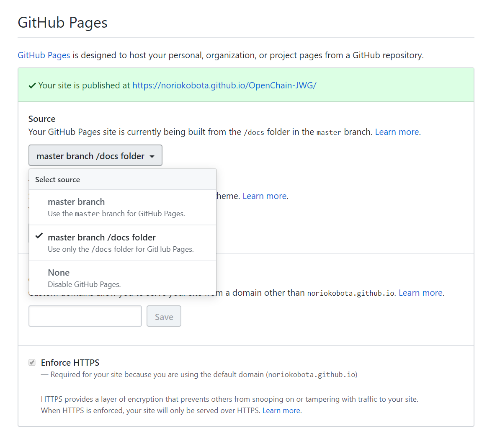
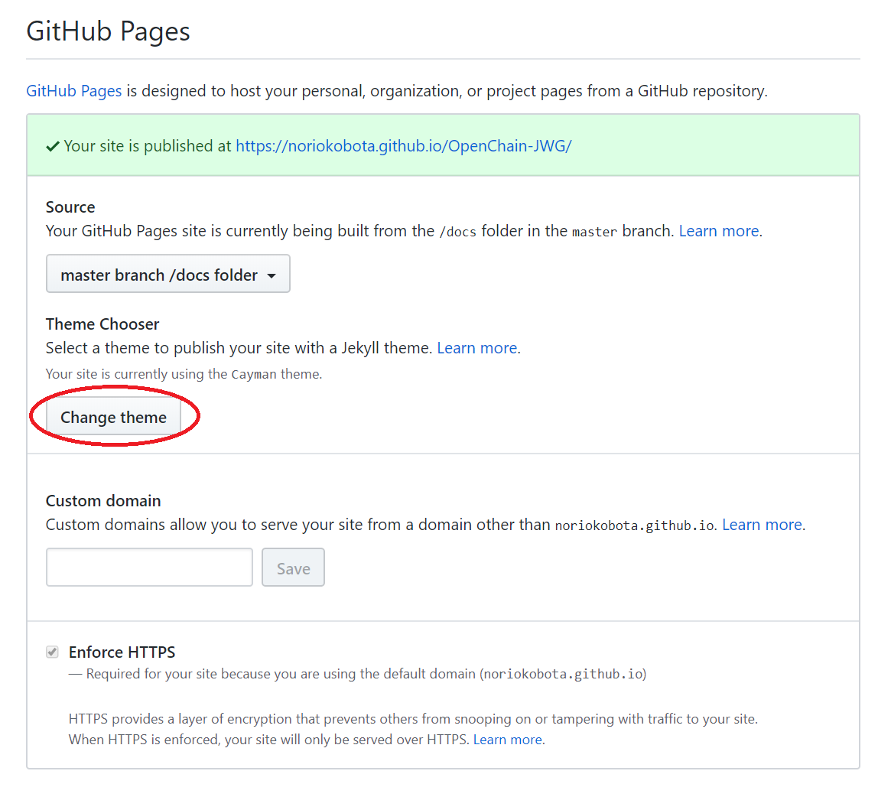

# how-to-migrate.md

## an example of Github Pages

Onboarding-JWG has already created the Github Pages, please see the following website for example.  
[https://OpenChain-Project.github.io/Onboarding-JWG/](https://OpenChain-Project.github.io/Onboarding-JWG/)  

## How to migrate from wiki to Github Pages

1. Create/prepare a repository: Under https://github.com/OpenChain-Project , create/prepare your repository. In this example, "OpenChain-JWG" is used.  
   
1. Create "docs" folder: After preparing "OpenChain-Project/OpenChain-JWG" repository, create "docs" folder.  
   Create "index.md": By using [jekyll](https://jekyllrb.com/), "index.md" is ftransformed from "index.html".  
     
1. Setting for GitHub Pages: The following instruction needs an admin attributen.
   1. Click ```Settings``` tab in "OpenChain-JWG" repository.  
     
   1. In Settings->Github Pages, change **```Source```** to **```master branch/docs folder```**.  
     
   After applying this settings, you can see the Website(GithubPages) at **```https://OpenChain-Project.github.io/[repository-name]/```**  
   1. If you want, you can change theme of the page.  **```Change theme```** . In this example, [Cayman](https://pages-themes.github.io/cayman/) is used. 
   The config looks like [docs/_config.yml](https://github.com/NorioKobota/OpenChain-JWG/blob/master/docs/_config.yml) Other settings can be refered in [Github Pages](https://help.github.com/github/working-with-github-pages/about-github-pages-and-jekyll), and jekyll  
   
1. Create contents of your Website in the "docs" folder. index.md, etc.  
Note: GitHub Pages has folder size limit of 1GB. [Guidelines for using GitHub Pages](https://help.github.com/en/github/working-with-github-pages/about-github-pages#guidelines-for-using-github-pages)  
   ```GitHub Pages source repositories have a recommended limit of 1GB.```  
  Note: It is recommended to place text-only files in the "docs" folder, and large size files like images should be placed in other folders.  
Note: It is easy and useful to use Emoji instead of an image file.[Emoji](https://unicode.org/emoji/charts/full-emoji-list.html)。 In **```Code```** , if the text code is ```U+1F600```, then you can display by writing ```&#x1F600;```.  
Note: We're not sure but storing many photos are not allowed in GitHub.  
1. An example of repository structure:  
   ```
   OpenChain-JWG +- docs-------+- index.md  
                 |             +- meetings   
                 |             +- subgroups   
                 |             +- outcomes    
                 +- Onboarding :   
                 +- General    :   
   ```
## EOF
