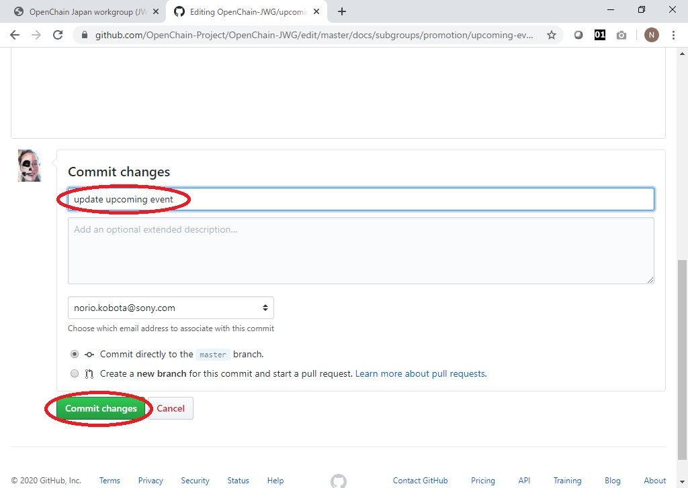
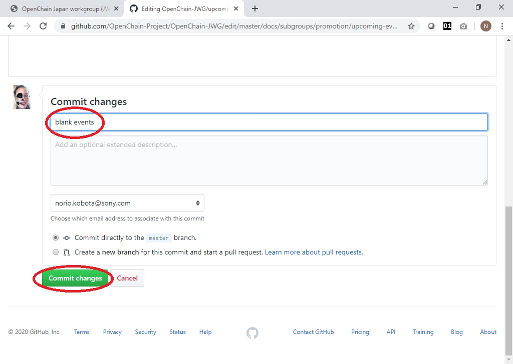

# Github Pages運用について

## はじめに

リポジトリの名前が変わりました。  
以前は、```https://github.com/OpenChain-Project/Onboarding-JWG/```でしたが、他国のリポジトリと同様に、  
https://github.com/OpenChain-Project/OpenChain-JWG  
と名前を切り替えました。ご注意ください。  

## Github Pagesとして公開されるWebページについて

https://github.com/OpenChain-Project/OpenChain-JWG/tree/master/docs  
以下に存在するmarkdownファイルを修正し、commit/pushすることによって、Webサイト  
https://openchain-project.github.io/OpenChain-JWG/  
として公開されます。 **なお更新は、ファイルを修正後、1分程度待たされる場合があります。**  

## branchの運用について

gitflowなど様々な方法論がありますが、慣れてない方も多いと思いますので、**master branchのみ**でいきましょう。慣れている方々は、どのようなbranching modelを採用して作業していただいても構いませんが、リポジトリ内に存在する不要なbranchは定期的に削除しましょう。  
**PRを送る方々は、上記リポジトリのmaster branchに対してsend pr**してください。  
**mergeの方法なども**色々ありますが、commit logの内容含めて**気にしない**こととします。write権以上を持つ方は、ローカルで作業後prしてセルフmergeするもよし、web上で編集するもよしのゆるゆる運用としましょう。  

## リポジトリ管理者(Admin, Write)へのお願い  

- 問い合わせについて  
管理者登録依頼などのGithubに関する問い合わせは、[OpenChain-JWG ML](https://lists.openchainproject.org/g/japan-wg)もしくは、[OpenChain-JWG Slack(github-help Channel)](https://openchain-japanwg.slack.com/archives/C011BDX3NRX)に問い合わせいただくこととして、管理者の方が対応ください。  
- サブグループ毎に、Write権限を持つ方を1名は登録し維持管理してください。  
※ サブグループページへのmerge requestが来た時には、各サブグループ毎に判断してください。  

## 今後のイベント / Upcoming Eventsの更新について

- docs/upcoming-events.md  
- docs/subgroups/{FAQ,education,leaflet,licensing,planning,promotion,tooling}/upcoming-events.md  

上記のファイル内に、何か記載するとトップページの今後のイベントに追加されますので、イベント日時等が決まり次第、更新していってください。なお、**GFM markdownとして正しくないと、正常に表示されない**のでご注意ください。  
例: リスト(箇条書き)は、改行する(最後に2個のスペースを入れる)こと  

### &rarr; Web から更新する方法  

1. 各subgroupsなどのディレクトリにあるupcoming-events.mdの編集ボタンを押す  

1. 次回イベントに関する告知を、[github マークダウン形式](https://github.github.com/gfm/)で記載する  

1. 下方向にスクロールし、メッセージを添えて、commitする  

1. 少し待てば、反映されます。いつまでたっても反映されない場合は、[github マークダウン形式](https://github.github.com/gfm/)を間違えている場合があります。そんな時は焦らず、何度でも修正してみてください。  

1. 予定がない場合は、全て削除して空ファイルを置いてください。  




## JWG全般の情報更新について  

まず、参加されている**どなたからのコントリビューションも大歓迎**ですので、お気軽にissueを立てたり、Send-PRしていただけると助かります。また、Write権限をお持ちの方は、適宜書き換えていただいて構いません。(self mergeしていただいて構いません)  
その前提で、主となって管理する方々を以下に記載しておきます。  

- JWG全体のイベント予定 - docs/upcoming-events.md 及び、全体会合の記録 - docs/meeting-minutes.md については、**Planning sgの方々でメンテナンスをお願い**します。  
- **全体ウェブサイト構成については、Promotion sgの方々が主となってメンテナンスをお願い**します。  
- 現時点(2020年4月6日時点)は、以下の通りのウェブページ構成となっています。ページ追加が必要になりましたら、適宜必要に応じて追加していってください。  
   - Promotion sgが主となって管理   
      - index.md : Github Pages 日本語トップページ  
      - index_en.md : Github Pages 英語トップページ  
   - Planning sgが主となって管理  
      - meeting-minutes.md : 全体会合の記録 日本語  
      - meeting-minutes_en.md : 全体会合の記録 英語  
      - outcomes.md : 成果物一覧 日本語  
      - outcomes_en.md : 成果物一覧 英語  

## 各サブグループメンバーへのお願い  

- **merge権限を持つ方を1名以上選出**してください。  
- サブグループのイベント予定の公開をお願いします。  
  **今後のイベント / Upcoming Eventsの更新について**にも記載しましたが、  
  ```https://github.com/OpenChain-Project/OpenChain-JWG/tree/master/subgroups/{サブグループ名}/upcoming-events.md```  
    を日程等が確定しましたら、定期的に更新してください。

- docs/subgroups/以下のmarkdownファイルが、サブグループサイトです。必要に応じて更新してください。  
- wikiのmediaに存在するサブグループに関係するファイル
   > https://wiki.linuxfoundation.org/openchain/openchain-japanese-working-group?do=media&ns=openchain  

   を、Githubの以下のフォルダ  
  > https://github.com/OpenChain-Project/OpenChain-JWG/tree/master/subgroups  

  に移動してください。  


EOF
