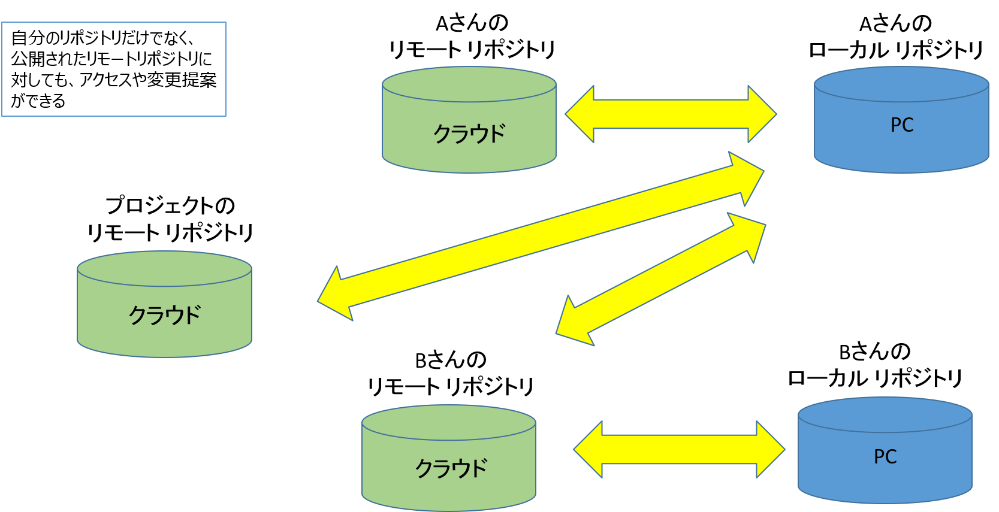

# How to start GitHub

## 初版：2018年7月25日
## 更新：2018年7月30日

# 目次

 * 前提条件
 * リポジトリのイメージ
 * ファイル表示
 * リポジトリ作成
 * 初期設定
 * 統計情報
 * 新規ファイル作成１
 * 新規ファイル作成＆Pull Request作成１
 * GitHub Desktop起動
 * 新規ファイル作成２
 * 新規ファイル作成＆Pull Request作成２
 * ブランチとPull Requestのイメージ
 * ブランチとリポジトリのイメージ
 * Issue登録
 * Issue & Pull Request運用例

# 前提条件

 * GitHub初心者向け
 * GitHubを主にドキュメント管理に使う人向け
　　（ソフトウェア開発にはもっと詳しい知識が必要）
 * Web上でGitHubアカウントを取得している
 * GitHub DesktopをPC上にインストールしている
 
 
# リポジトリのイメージ１

* リポジトリ：　ファイルやディレクトリの状態（変更履歴等）を記録する場所

* クラウド
  * Web Browserで操作
  * Clone / Download
  * クラウド上でCloneもできる
  * リモート リポジトリ

* PC
  * GitHub Desktop / Windowsで操作
  * ローカル環境にリポジトリをClone（コピー）してローカル環境で構成管理をしながら作業する
  * リモートとローカル環境の同期を取る必要がある
  * Sync
  * ローカル リポジトリ
  * Commit

# リポジトリのイメージ２

* クラウド
  * Aさん リモート リポジトリ

* クラウド
  * Bさんのリモート リポジトリ

* クラウド
  * プロジェクトのリモート リポジトリ

* PC
  * Aさんのローカル リポジトリ

* PC
  * Bさんのローカル リポジトリ

* 自分のリポジトリだけでなく、公開されたリモートリポジトリに対しても、アクセスや変更提案ができる

# ファイル表示

* Web上での作業
  * GitHubの適当なリモートリポジトリへ移動
    * 以下はOpenChain-Project/OpenChain-JWGを例にとって説明（https://github.com/OpenChain-Project/OpenChain-JWG）
  * README.mdをクリック
    * REAME.mdの内容が表示される
      * “md”はMarkdownフォーマット: READMEやLICENSEなどGitHub上のテキストファイルはmdフォーマットで記述されることが多い
  * OpenChain-JWG/Leaflet/One-Page_Version/review/へ移動（https://github.com/OpenChain-Project/OpenChain-JWG/tree/master/Leaflet/One-Page_Version/review）
  * a_openchain_leaflet_20180615.pptxをクリック
  * Downloadをクリック
  * ファイルがPCにDownloadされる
 
# リポジトリ作成

  * Web上での作業
    * 自分のProfile画面 -> Repositories
      * Newを押す
    * リポジトリ名を入力
      * Descriptionを簡単に入力
      * Publicを選択
      * Add .gitignore:　None
      * Add a license:　None　（選択できる候補にはドキュメントに適したLicenseは無さそう）
    * Create repositoryを押す
    * リモートリポジトリが作成される
    * 自分のProfile画面にリモートリポジトリが表示される
 
  * [自分のProfile画面]
    * 右上のアイコンをクリックするとプルダウンメニューが表示される
    * Your Profileを選択

# 統計情報

## 初期設定

   * Web上での作業
     * 作成したリモートリポジトリへ移動
     * README.mdの作成
       * そのままでも良いし、少し何か書いてもよい
     * リモートリポジトリへCommit
     * Insights -> Community
       * 以下の作成が推奨
         * README.md
         * LICENSE.md
         * CONTRIBUTING.md
         * Code_of_Conduct.md
           * Markdown形式で記述
     * Settings -> Collaborators
       * GitHubのアカウントを持つ人に変更権を付与できる
   * Web上での作業
     * Insights -> Traffic
       * 統計情報が表示される
     * Insights -> Network
       * ブランチや変更のイメージ図が表示される
 
# 新規ファイル作成１

* Windows上での作業
  * エディタ等でテキストファイルを作成
  * ローカルリポジトリを作成する前であれば、リポジトリ外にファイルを作成したことになる
  * ローカルでは変更が管理されていない状態

 * Web上での作業
   * Upload filesを押す
   * テキストファイルをドラッグする
   * コメント記入
   * Masterブランチを選択
   * （リモートリポジトリへ）Commitする

# 新規ファイル作成＆Pull Request作成１

* Windows上での作業
  * テキストファイルを作成
    * ローカルリポジトリを作成する前であれば、リポジトリ外にファイルを作成したことになる
    * ローカルでは変更が管理されていない状態
* Web上での作業
  * Upload filesを押す
  * テキストファイルをドラッグする
  * コメント記入
  * Newブランチを選択
  * Propose Changesを押す
  * （リモートリポジトリへ）Pull Requestが作成される

# GitHub Desktop起動１

* Windows上での作業
  * GitHub Desktopを
    * GitHubアカウントでログイン
      * (1)未だWindows上にClone（ローカルリポジトリ）がない場合
        * File -> Clone repository
        * 作成したGitHubのリモートリポジトリを選択
        * Cloneを押す
        * Windows上にClone（ローカルリポジトリ）が作成され、GitHub Desktop上にも登録される
      * (2)既にWindows上にCloneがあるが、GitHub Desktopに登録されていない場合
        * File -> Add local repository
        * PC上のローカルリポジトリを選択
        * Add repositoryを押す
        * GitHub Desktop上にローカルリポジトリが登録される
 
* Web上での作業
  * Clone or Downloadを押す
    * GitHub Desktopが自動的に起動
    * GitHubフォルダ内にローカルリポジトリが作成される

# GitHub Desktop起動２

 注：クラウド上でもClone（リモートリポジトリ）を作成できる
　一度前頁の設定が完了している場合
 
* Web上での作業
  * Clone or Downloadを押す
    * GitHub Desktopが自動的に起動
    * GitHub Desktopのローカルリポジトリが自動的に更新される

# 新規ファイル作成＆Pull Request作成２

* Windows上での作業
  * ローカルリポジトリへ移動
  * ローカルリポジトリ内のフォルダへ移動または作成
  * テキストファイルを作成

* GitHub Desktopでの作業
  * 先ほど作成したテキストファイルがあることを確認
  * 上の方のブランチアイコンを押す
  * ブランチ名を作成
  * ローカルリポジトリのブランチへCommit
  * リモートリポジトリへPush

* Web上での作業
  * リモートリポジトリに先ほど作成したブランチがあることを確認
  * Compare & Pull requestを押す
  * リモートリポジトリでPull Requestを作成

# 新規ファイル作成２

* Windows上での作業
  * ローカルリポジトリへ移動
  * ローカルリポジトリ内のフォルダへ移動または作成
  * テキストファイルを作成

* GitHub Desktopでの作業
  * 先ほど作成したテキストファイルがあることを確認
  * （ローカルリポジトリへ）Commit
  * （リモートリポジトリへ）Push

* Web上での作業
  * 先ほど作成したテキストファイルがリモートリポジトリにあることを確認
　
 
# ブランチとPull Requestのイメージ

* Masterブランチ
  * Masterブランチ上で直接変更

* 作業用ブランチ
  * 作業用ブランチ上で変更＆Pull Request
  * レビュー＆許可されれば、Masterブランチに変更がMergeされる

* Insight -> Network
  * 変更やブランチの様子を確認できる
  * 作業ブランチを作成したタイミングからMergeまでのタイミングで、Masterブランチに変更が入っていると、両ブランチの変更を反映させる必要がある。

# ブランチとリポジトリのイメージ

Masterブランチ

作業用ブランチ上で変更＆Pull Request

Masterブランチ
作業用ブランチ

作業用ブランチ上で変更＆Pull Request

Masterブランチ
作業用ブランチ

作業用ブランチ上で変更＆Pull Request

Masterブランチ
作業用ブランチ

Push
リモートリポジトリ
ローカルリポジトリ

Push前
Push後

リモートリポジトリ
ローカルリポジトリ
ローカルリポジトリで作業した内容は、Pushするまではリモートリポジトリに反映されない

# Issue登録

* Web上での作業
  * リモートリポジトリへ移動
  * Issuesを押す
    * New Issueを押す
      * Titleに題名を記載する
      * Commentを記載する
        * ファイルをComment欄にドラッグすることでUpload可能
        * （オプション）
          * Assigneeを選択
          * Labelsを選択
          * Milestoneを記載
      * Submit New Issueを押す
 
　　* 登録後にも編集可能

# Issue & Pull Request運用例

* 課題発見
* Issue Registered
* Pull Request
* Review
* Merge
* Issue Resolved
* 課題解決

